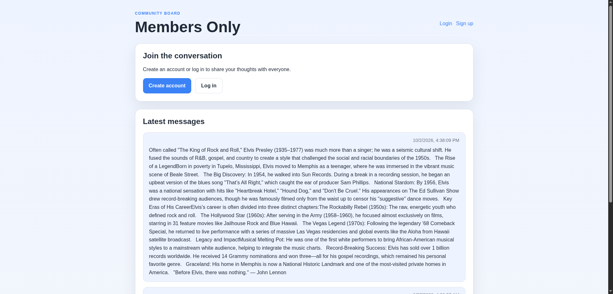
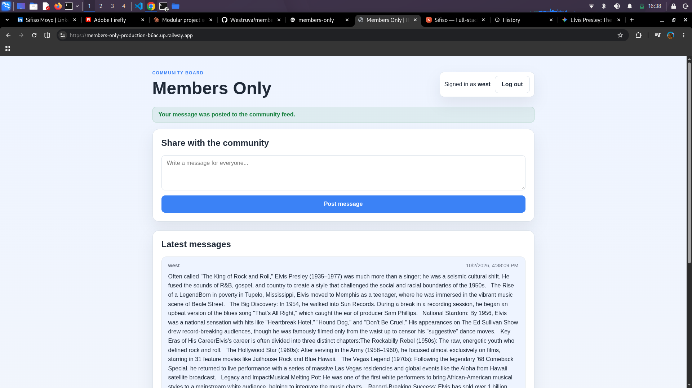

# Members Only

A simple bulletin board app with signup, login, and a global message feed.

## Local development

1. Copy the environment example:
   ```bash
   cp .env.example .env
   ```
2. Start PostgreSQL locally and create a database named `members_only`.
3. Install dependencies:
   ```bash
   npm install
   ```
4. Run the app:
   ```bash
   npm start
   ```

## Notes

- The app creates its required tables on startup if they do not already exist.
- The app expects a PostgreSQL database with the `pgcrypto` and `uuid-ossp` extensions available.

https://members-only-production-b6ac.up.railway.app/



